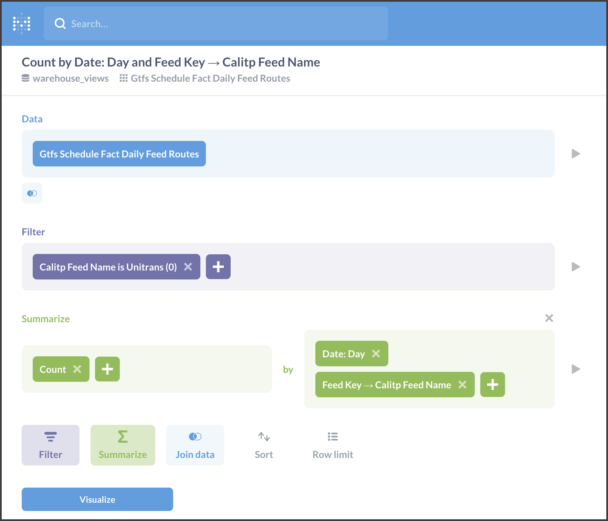
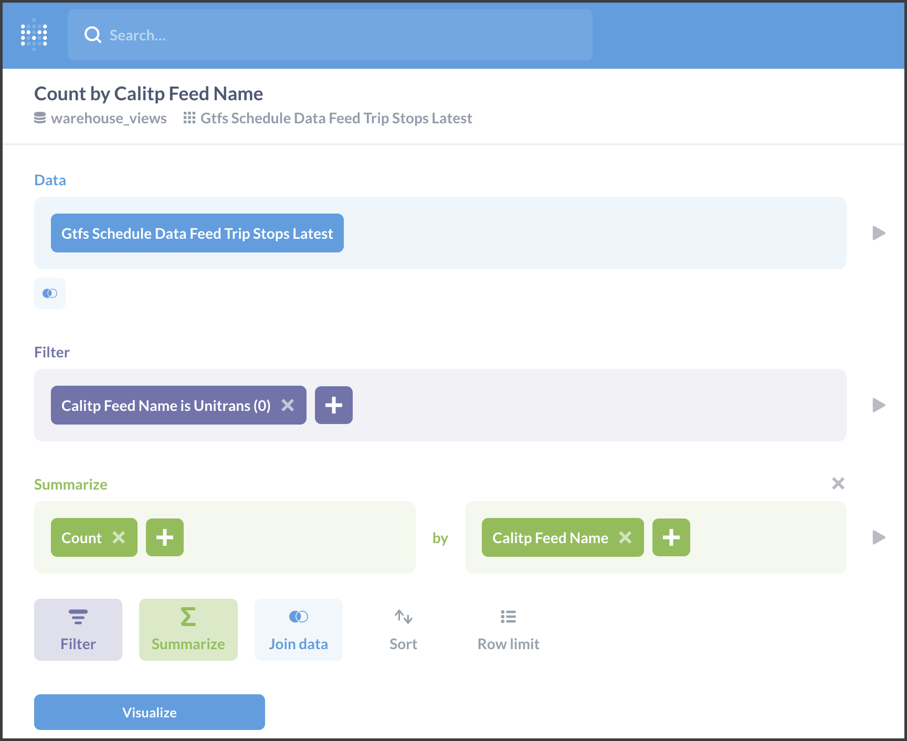
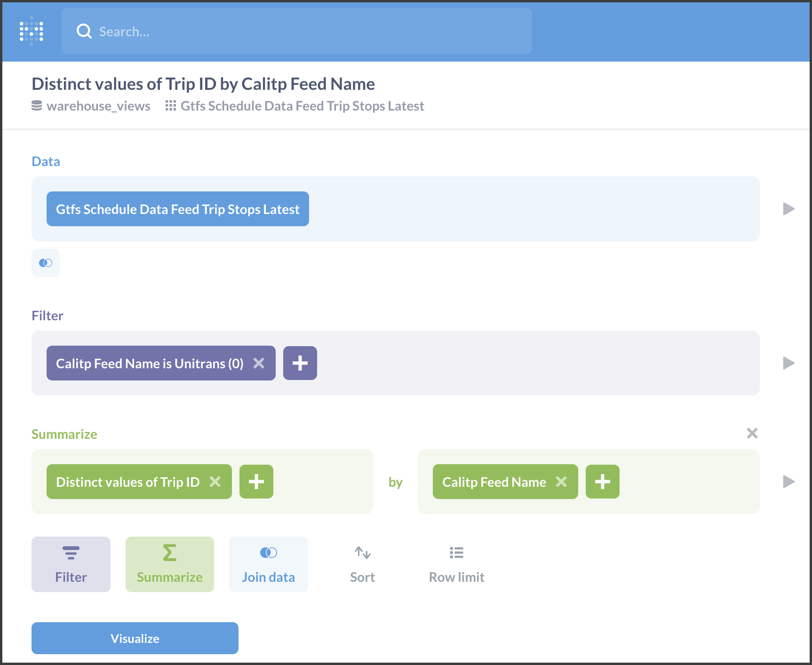
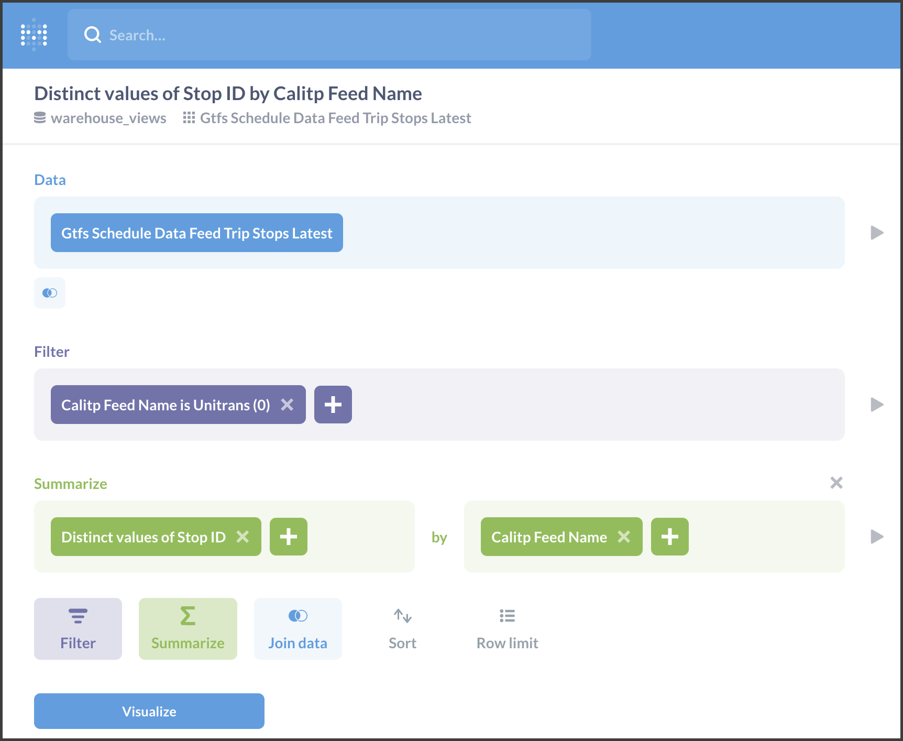

# Issue #329

```python
from calitp.tables import tbl
from calitp import query_sql
from siuba import *
import pandas as pd
from sqlfluff import fix
pd.set_option("display.max_rows", 20)
```

## 1. Number of Routes for a Given Agency Over Time


### SQL


**Primary Fact Table** → views.gtfs_schedule_fact_daily_feed_routes  
**Secondary Tables** →  views.gtfs_schedule_dim_feeds

*Time* → date (GROUP BY)  
*Geography* → route_key (COUNT)  
*Agency* → Join w/ views.gtfs_schedule_dim_feeds on feed_key for calitp_feed_name (GROUP BY)

```python
query_sql("""

SELECT
    calitp_feed_name,
    date,
    count(*) AS count_feeds
FROM `views.gtfs_schedule_fact_daily_feed_routes`
JOIN `views.gtfs_schedule_dim_feeds` USING (feed_key)
WHERE
    calitp_feed_name = "Unitrans (0)"
GROUP BY
    1, 2
ORDER BY
    date DESC
LIMIT 10

""")
```

### Metabase


**Primary Fact Table** → Gtfs Schedule Fact Daily Feed Routes





### Siuba

```python
# Join to get CalITP Feed Names
# Count routes by date and CalITP Feed Names, order by date, filter by specific calitp_feed_name

(
    tbl.views.gtfs_schedule_fact_daily_feed_routes()
    >> left_join(_, tbl.views.gtfs_schedule_dim_feeds(), "feed_key")
    >> filter(_.calitp_feed_name == "Unitrans (0)")
    >> count(_.date)
    >> arrange(_.date)
)
```

## 2. Number of Stops for a Given Agency Over Time


### SQL


**Primary Fact Table** → views.gtfs_schedule_fact_daily_feed_stops  
**Secondary Tables** →  views.gtfs_schedule_dim_feeds  

*Time* → date (GROUP BY)  
*Geography* → stop_key (COUNT)  
*Agency* → Join w/ views.gtfs_schedule_dim_feeds on feed_key for calitp_feed_name (GROUP BY)

```python
query_sql("""

SELECT
    calitp_feed_name,
    date,
    count(*) AS count_stops
FROM `views.gtfs_schedule_fact_daily_feed_stops`
JOIN `views.gtfs_schedule_dim_feeds` USING (feed_key)
WHERE
    calitp_feed_name = "Unitrans (0)"
GROUP BY
    1, 2
ORDER BY
    date
LIMIT 10

""")
```

### Metabase


**Primary Fact Table** → Gtfs Schedule Fact Daily Feed Stops


### Siuba

```python
## Join to get CalITP Feed Names
## Count stops by date and CalITP Feed Names, order by date, filter by specific calitp_feed_name

(
    tbl.views.gtfs_schedule_fact_daily_feed_stops()
    >> left_join(_, tbl.views.gtfs_schedule_dim_feeds(), "feed_key")
    >> count(_.date, _.calitp_feed_name)
    >> filter(_.calitp_feed_name == "Unitrans (0)")
    >> arrange(_.date)
)
```

## 3. Number of Stops Made Across all Trips for an Agency


### SQL


**Primary Fact Table** → views.gtfs_schedule_data_feed_trip_stops_latest  
**Secondary Tables** →  views.gtfs_schedule_fact_daily_trips  
                        views.gtfs_agency_names

*Time* → no variable - this table only has information for the current day  
*Geography* → stop_time_key (COUNT)  
*Agency* → calitp_feed_name (GROUP BY)

```python
query_sql("""

SELECT
    calitp_feed_name,

    count(*) AS n_trip_stops,
    count(distinct(trip_id)) AS n_trips,
    count(distinct(stop_id)) AS n_stops
FROM `views.gtfs_schedule_data_feed_trip_stops_latest`
WHERE
    calitp_feed_name = "Unitrans (0)"
GROUP BY
    calitp_feed_name

""")
```

### Metabase


**Primary Fact Table** → Gtfs Schedule Data Feed Trip Stops Latest


*Count of Trip Stops Made Across all Trips for an Agency*





*Distinct Trips in Trip Stops*





*Distinct Stops in Trip Stops*





### Siuba

```python
(
    tbl.views.gtfs_schedule_data_feed_trip_stops_latest()
    >> filter(_.calitp_feed_name == "Unitrans (0)")
    >> summarize(
        n_trips=_.trip_id.nunique(), n_stops=_.stop_id.nunique(), n=_.trip_id.size()
    )
)
```

## 4. For a Given Agency, on Each Day, Days Until the Feed Expires 


### SQL


**Primary Fact Table** → views.gtfs_schedule_fact_daily_feeds  
**Secondary Fact Table** → views.gtfs_schedule_dim_feeds

*Time* → date, feed_end_date  
*Measure* → days_until_feed_end_date  
*Agency* → calitp_feed_name (GROUP BY)

```python
query_sql("""

SELECT
    calitp_feed_name,
    date,
    days_until_feed_end_date,
    feed_end_date
FROM views.gtfs_schedule_fact_daily_feeds
JOIN views.gtfs_schedule_dim_feeds USING (feed_key)
WHERE
    date = "2021-09-01" AND calitp_feed_name = "Unitrans (0)"

""")
```

### Metabase


**Primary Fact Table** → views.gtfs_schedule_fact_daily_feeds  
**Secondary Fact Table** → views.gtfs_schedule_dim_feeds


### Siuba


**Primary Fact Table** → views.gtfs_schedule_fact_daily_feeds  
**Secondary Fact Table** → views.gtfs_schedule_dim_feeds

```python
(
    tbl.views.gtfs_schedule_fact_daily_feeds()
    >> left_join(_, tbl.views.gtfs_schedule_dim_feeds(), "feed_key")
    >> select(_.calitp_feed_name, _.date, _.days_until_feed_end_date, _.feed_end_date)
    >> filter(_.date == "2021-09-01", _.calitp_feed_name == "Unitrans (0)")
)
```

## 5. Max Number of Stops a Trip Can Have, Per Agency


### SQL


**Primary Fact Table** →  views.gtfs_schedule_data_feed_trip_stops_latest
**Secondary Tables** →  views.gtfs_schedule_dim_feeds

*Time* → date (GROUP BY)  
*Geography* → trip_id (GROUP BY)  
*Geography* → count (COUNT)  
*Agency* → Join w/ views.gtfs_schedule_dim_feeds on feed_key for calitp_feed_name (GROUP BY)

```python
query_sql("""

WITH

counting_stop_times AS (

    -- count the number of stops each trip in each feed makes
    SELECT
        trip_id,
        calitp_feed_name,
        COUNT(*) AS n_trip_stop_times
    FROM `views.gtfs_schedule_data_feed_trip_stops_latest`
    GROUP BY
        1, 2
)

-- calculate the max number of stops made by a feed's trip
-- we filter to keep only the Unitrans feed for this example
SELECT
    calitp_feed_name,
    MAX(n_trip_stop_times) AS max_n_trip_stop_times
FROM
    counting_stop_times
WHERE
     calitp_feed_name = "Unitrans (0)"
GROUP BY
    calitp_feed_name


""")
```

### Metabase


**Primary Fact Table** → views.gtfs_schedule_data_feed_trip_stops_latest


### Siuba

```python
(
    tbl.views.gtfs_schedule_data_feed_trip_stops_latest()
    >> count(_.trip_id, _.calitp_feed_name)
    >> filter(_.calitp_feed_name == "Unitrans (0)")
    >> summarize(n_max=_.n.max())
)
```
